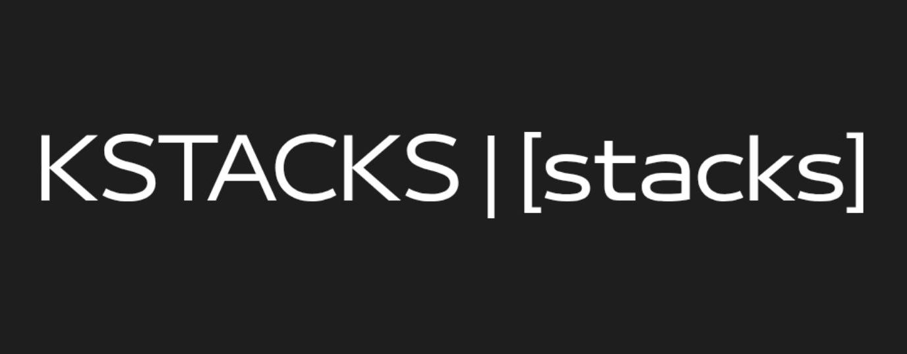

## kstacks

A lightweight, dependency-free byte-level stack implementation in pure C.

## Features

- No external dependencies
- Custom type definitions (no stdint.h/stddef.h)
- Byte-level operations
- Dynamic expansion
- Error handling via return values and error pointers

## Usage

Check examples/

## Build

```bash
make clean && make
```

Produces libkstacks.a.

## API

| Function | Description |
|----------|-------------|
| `kcreate` | Initialize the stack |
| `kfree`   | Free the stack |
| `kpush`   | Push a byte |
| `kpop`    | Pop a byte |
| `kpeek`   | View top byte without removing |
| `kexpand` | Expand the stack |
| `kcount`  | Count elements |

## License

MIT (check LICENSE)
